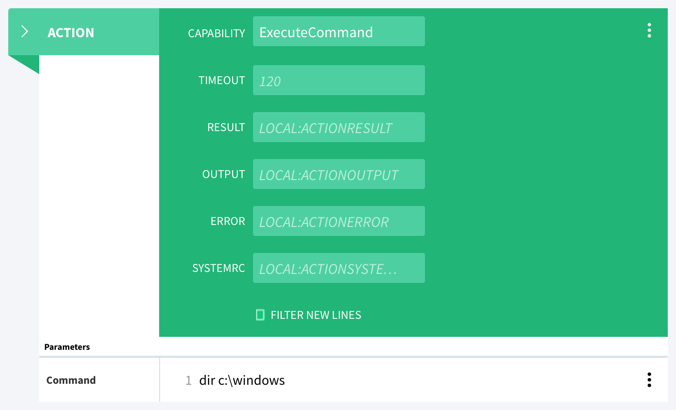
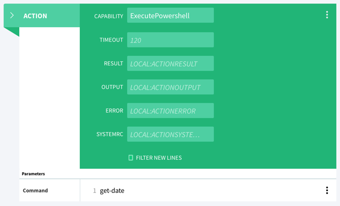

# WinRM ActionHandler with SSL encryption and Certificate Authentication

## Overview
This ActionHandler allows the remote execution of both cmd.exe and Powershell commands on Windows targets via the WinRM protocol. It uses SSL encryption and authentication is achieved by a SSL client certificate, so there is no need to store passwords or password hashes in AutoPilot.

There are various ways to distribute the necessary certificates to the target machines. In this guide, I will cover both the use of an Active Directory Certification infrastructure as well as the usage of OpenSSL.

## Certification infrastructure

To connect to a windows machine using WinRM with SSL encryption and client certificate authentication, two certificates need to be present on the target machine:

1. A server certificate that identifies the machine.
2. A trusted client certificate to identify the user account that will be used to connect.

Both certificates have to be in the same trust chain, i.e. be signed by the same root authority or by intermediate certification authories that themselves are both certified by the same root CA. The certificate of this root CA has also to be present in the list of trusted CAs.

### Active Directory and Windows Enterprise Certification Authority

**!!! This part of the guide is not yet finished and will be updated soon. !!!**

If present, an Active Directory Domain Service in conjuction with a Microsoft Windows Enterprise Certification Authority can be used to generate and distribute the necessary SSL certificates to the target machines. This way, even a large number of servers can be automatically configured by Active Directory group policies.

In a properly set up Windows domain with an Enterprise CA, all servers that are part of the domain automatically receive a server certificate and have the signing Enterprise CA in their list of trusted root CAs. All we need to do is to create the client certificate and distribute it via an additional group policy.

### OpenSSL

When no Active Directory and no Windows Certification Authority are present, we can generate the certificates on the AutoPilot machine (or any other Unix/Linux server) using the OpenSSL command line utility, effectively creating our own certification authority.

Please make sure that OpenSSL is installed on your Linux server. If not, install it using the system's package manager (apt, yum, …)

OpenSSL can be used in a great number of ways, covering almost any scenario. Unfortunately, this means that configuring it can be a very complex task. Therefore in this guide, we will use our own, minimal configuration file. It can be obtained here: [openssl-ap.cnf](resources/openssl-ap.cnf).

First, create a new directory on your Linux machine, secure it and change your working directory to its path:

```bash
mkdir -m700 autopilot-ca; cd autopilot-ca
```

Download the openssl configuration file and put it into the same directory.

#### Creating the root certificate

To create the root certificate, first create a new private key:

```bash
touch root.key && chmod 600 root.key
openssl genrsa -aes256 -out root.key 2048
chmod 400 root.key
```

You will be prompted for a password. **This password will protect the private key of your root certificate, so choose a strong one and make sure it does not get lost.** If someone was able to obtain this private key, he could sign his own certificates in your name, basically enabling him to break into any system that trusts your root certificate. In our scenario, this would be all your servers. The password-protected key will be stored in the file *root.key* and the permissions of that file will set so that only you can read it.

After you have a private key for your root certificate, create the certificate itself. You will be prompted for your private key's password and some additional information that will be stored in the certificate. Then asked for a 'Common Name', enter 'My AutoPilot root CA'.

```bash
touch root.crt && chmod 600 root.crt
openssl req -config openssl-ap.cnf -x509 -new -nodes -extensions v3_ca -key root.key -days 1024 -out root.crt -sha512
chmod 400 root.crt
```

The new certificate will be stored in the file *root.crt*. Again, the file will only be readable by yourself. At this point, you should **create one or several backups** of both your *root.key* and your *root.crt*.

#### Creating the server certificate(s)

In the next step, we have to create a server key and certificate for each target machine. Because they will basically all look the same, we will use a shell script to process a list of server names. First, create a file called *servers.txt* with one hostname per line. It should look like that:

```bash
server1.example.com
server2.example.com
…
```

Then create a new subdirectoy *servers* where we will store the created keys and certificates:

```bash
mkdir -m700 servers
```

Finally, download the script [create-server-certs.sh](resources/create-server-certs.sh), place it in your current working directory *autopilot-ca* and make it executable:

```bash
chmod 700 create-server-certs.sh
```

Then call the script with the list of servers and the directory to store the generated certificates. Because we will import these certificates on Windows machines, both the key and the certificate will be stored in the same *.pfx* file.

The script will prompt you for the pass phrase of the private root key and a new export password that will be used to protect the created certificates. You will need the export password when you import the files on Windows. To keep it simple, all generated server certificates will have the same password, as it is only needed to securely transmit them to their destination server.

```bash
./create-server-certs.sh -c openssl-ap.cnf -r root.crt -k root.key -d servers -u C=your_country_code -u ST='your_state' -u L='your location e.g. city' -u O='your organisation e.g. company name' -u OU='your organisational unit e.g. department' servers.txt
Enter pass phrase for root.key: *******
Enter export password for server certificates: ****
Verifying - Enter export password for server certificates: ****
certificate saved as servers/server1.example.com.pfx
certificate saved as servers/server2.example.com.pfx
…
all done
```

#### Creating the client certificate

Last step is to create a client certificate for AutoPilot. Replace `<country_code>`, `<state>`, `<city>`, `<company>` and `<department>` with the respective values (they may contain whitespace).

```bash
touch autopilot.key && chmod 600 autopilot.key
openssl genrsa -out autopilot.key 4096
chmod 400 autopilot.key
export SAN=_; openssl req -config openssl-ap.cnf -new -key autopilot.key -subj "/C=<country_code>/ST=<state>/L=<city>/O=<company>/OU=<department>/CN=autopilot" | openssl x509  -req -days 365  -CA root.crt -CAkey root.key -CAcreateserial -out autopilot.crt
```
This will create two files, *autopilot.key* and *autopilot.crt*. The *.crt* certificate file needs to be copied to each server. It does not need password protection as it only contains the (public) certificate part.

The *.key* file is more critical, as it contains the private key of the client certificate. Whoever gets hold of this file will be able to log into your servers, so be very careful.

#### Importing the certificates on the Windows machines

Now the certificates need to be transferred to the Windows machines. **Each machines needs a set of three certificates**:

1. The root certificate *root.crt*, without the private key.
2. The server certificate *servers/hostname.domain.pfx* with both the certificate and the private key, password–protected
3. The client certificate *autopilot.crt*, without the private key.

## WinRM configuration

In order to setup Windows for secure remote access, the WinRM service needs to be enabled, a SSL listener has to be created and the client certificate we're going to use has to be mapped to a local user account.

### Importing the certificates

#### Open the Microsoft Management Console (mmc.exe) and add the certificates snap-in for the local machine:

Screencast:

[](https://www.youtube.com/watch?v=luhwmfmTOYY)

#### Import the root certificate into the 'Trusted Root Certification Authorities' store:

Screencast:

[](https://www.youtube.com/watch?v=8RvIkygImlk)

#### Import the server certificate into the 'Personal' store:

You will need to enter the export password you chose earlier.

Screencast:

[](https://www.youtube.com/watch?v=l2N9QMbL4ck)


#### Import the client certificate into the 'Trusted People' store:

Screencast:

[](https://www.youtube.com/watch?v=3G1shxNDyR8)


### Enable and start the WinRM service

The commands in this and the following sections are mostly PowerShell commands. The only exception is the netsh command. It can be executed in a PowerShell window nonetheless.

```powershell
Set-Service winrm -StartupType Automatic -Status Running
```

### Creating a SSL listener for WinRM

Find the thumbprint of your server certificate:

```powershell
Get-ChildItem cert:\LocalMachine\My

Thumbprint                                Subject
----------                                -------
7E2E1055471FFC90DABCAEBE24C3196C15201983  CN=srv1.adlab.loc, OU=Sales, O=arago GmbH, L=Frankfurt am Main, S=Hessen, C=DE
```

Create the new HTTPS listener. Replace `<your_thumbprint>` by the actual thumbprint of your server certificate.


```powershell
New-WSManInstance winrm/config/Listener -SelectorSet @{Address="*";Transport="HTTPS"} -ValueSet @{CertificateThumbprint="<your_thumbprint>"}
```

### Add a firewall exception for port 5986

```bat
netsh advfirewall firewall add rule name="Windows remote management HTTPS inbound" protocol=TCP dir=in localport=5986 action=allow
```

### Register the configurations for PowerShell sessions


```powershell
Register-PSSessionConfiguration -Name Microsoft.PowerShell -Force
Register-PSSessionConfiguration -Name Microsoft.PowerShell.Workflow -Force
```

If you are on a 64 bit operating system (you most certainly are), also execute the following command:

```powershell
Register-PSSessionConfiguration Microsoft.Powershell32 -processorarchitecture x86 -force
```


### Certificate mapping

Find the certificate thumbprint of your root CA (My AutoPilot root CA, line 8 in the example) in the cert store:

```powershell
PS C:\Windows\System32\WindowsPowerShell\v1.0> Get-ChildItem -Path cert:\LocalMachine\Root

Thumbprint                                Subject
----------                                -------
CDD4EEAE6000AC7F40C3802C171E30148030C072  CN=Microsoft Root Certificate Authority, DC=microsoft, DC=com
BE36A4562FB2EE05DBB3D32323ADF445084ED656  CN=Thawte Timestamping CA, OU=Thawte Certification, O=Thawte, L=Durbanville, S=Western Cape, C=ZA
A43489159A520F0D93D032CCAF37E7FE20A8B419  CN=Microsoft Root Authority, OU=Microsoft Corporation, OU=Copyright (c) 1997 Microsoft Corp.
9168F7AF1BEAE0768CD541CB59D410E2FBBDD122  E=mklemm@arago.de, CN=My AutoPilot root CA, OU=Sales, O=arago GmbH, L=Frankfurt am Main, S=Hessen, C=DE
7F88CD7223F3C813818C994614A89C99FA3B5247  CN=Microsoft Authenticode(tm) Root Authority, O=MSFT, C=US
245C97DF7514E7CF2DF8BE72AE957B9E04741E85  OU=Copyright (c) 1997 Microsoft Corp., OU=Microsoft Time Stamping Service Root, OU=Microsoft Corporation...
18F7C1FCC3090203FD5BAA2F861A754976C8DD25  OU="NO LIABILITY ACCEPTED, (c)97 VeriSign, Inc.", OU=VeriSign Time Stamping Service Root, OU="VeriSign, ...
742C3192E607E424EB4549542BE1BBC53E6174E2  OU=Class 3 Public Primary Certification Authority, O="VeriSign, Inc.", C=US
4EB6D578499B1CCF5F581EAD56BE3D9B6744A5E5  CN=VeriSign Class 3 Public Primary Certification Authority - G5, OU="(c) 2006 VeriSign, Inc. - For autho...
```

Add a mapping to a local user account. Replace `<your_thumbprint>` by the actual thumbprint of your root certificate. You will be asked for the account name and the credentials. This should be an account with administrative permissions, i.e. a member of the Administrators group:

```powershell
New-Item -Path WSMan:\localhost\ClientCertificate -Credential (Get-Credential) -Subject autopilot -URI * -Issuer <your_thumbprint> -Force
```

### Enable certificate authentication

Last step is to enable certificates as an authentication method for the winrm service:

```
Set-Item -Path WSMan:\localhost\Service\Auth\Certificate -Value $true
```

Additionally, you can disable Basic authentication since it is insecure:

```
Set-Item -Path WSMan:\localhost\Service\Auth\Basic -Value $false
```

Windows should now be configured for WinRM access using SSL certificates.

## AutoPilot ActionHandler

The remaining steps need to be taken on the AutoPilot engine node. 

### Installing python >= 2.7.9

CentOS 6.7 comes with python 2.6.6 pre-installed but the pywinrm library used by this ActionHandler requires python >= 2.7.9. The [IUS Community Project](https://ius.io) provides a repository with the latest release. You can find more information on their [Getting Started](https://ius.io/GettingStarted/) page.

On the AutoPilot machine, download and install the repository. Afterwards, install python 2.7 and some additional python modules:

```bash
curl -L 'https://centos6.iuscommunity.org/ius-release.rpm' >ius-release.rpm
yum -y localinstall ius-release.rpm
yum -y install python27 python27-pip
pip2.7 install isodate xmltodict pytest pytest-cov pytest-pep8 mock pywinrm
```

### Installing and configuring the Actionhandler

Download the WinRM client [winrm-client.py](resources/winrm-client.py) and put it into `/opt/autopilot/bin/` on the AutoPilot engine node. Put both the client certificate `autopilot.crt` and the private key `autopilot.key` into `/opt/autopilot/conf/certs`

Add the following to your `/opt/autopilot/conf/aae.yaml` in the GenericHandler section:

```yaml
- Applicability:
    Priority: 60
    ModelFilter:
      Var:
        Name: NodeType
        Mode: string
        Value: Machine
      Var:
        Name: MachineClass
        Mode: string
        Value: Windows
  Capability:
  - Name: ExecuteCommand
    Description: "execute cmd.exe command on remote host"
    Interpreter: python2.7 /opt/autopilot/bin/winrm-client.py -H ${Hostname} -c ${Certificate} -k ${Keyfile} -i cmd ${TEMPFILE}
    Command: ${Command}
    Parameter:
    - Name: Command
      Description: "DOS command to execute"
      Mandatory: true
    - Name: Hostname
      Description: "host to execute command on"
      Mandatory: true
    - Name: Certificate
      Description: "path to the client certificate"
      Default: /opt/autopilot/conf/certs/autopilot.crt
    - Name: Keyfile
      Description: "path to the client certificate's private key"
      Default: /opt/autopilot/conf/certs/autopilot.key
  - Name: ExecutePowershell
    Description: "execute powershell command on remote host"
    Interpreter: python2.7 /opt/autopilot/bin/winrm-client.py -H ${Hostname} -c ${Certificate} -k ${Keyfile} -i powershell ${TEMPFILE}
    Command: ${Command}
    Parameter:
    - Name: Command
      Description: "Powershell command to execute"
      Mandatory: true
    - Name: Hostname
      Description: "host to execute command on"
      Mandatory: true
    - Name: Certificate
      Description: "path to the client certificate"
      Default: /opt/autopilot/conf/certs/autopilot.crt
    - Name: Keyfile
      Description: "path to the client certificate's private key"
      Default: /opt/autopilot/conf/certs/autopilot.key
```

Restart autopilot-engine.

## Usage in Knowledge Items

Both ActionHandlers support batch/script execution. For cmd.exe, all elements of Windows/MS-DOS .bat files are supported. Your batch will be prepended by an "@echo off".

For Powershell, you can use every feature of the language. The only limit is the usage of the additional I/O-channels by cmdlets like write-warning, write-verbose and write-debug. Warnings will be written to the standart output channel, prepended by the term "WARNING:". This term will, in fact, be localized, so for a german Windows installation it will be "WARNUNG:" etc., so don't depend on this particular string in your Knowledge Items.


With the above ActionHandler configuration, you can execute DOS commands on machine nodes with MachineClass 'Windows' by using the standard ExecuteCommand capability.



In order to execute Powershell scripts, use the capability ExecutePowershell:
